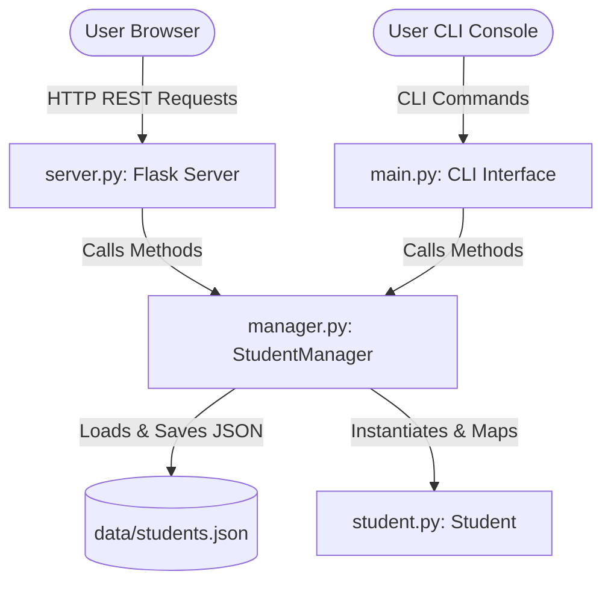
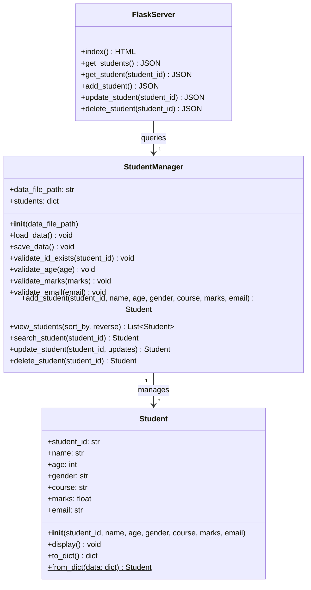
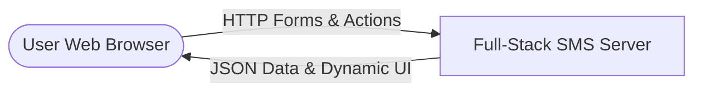
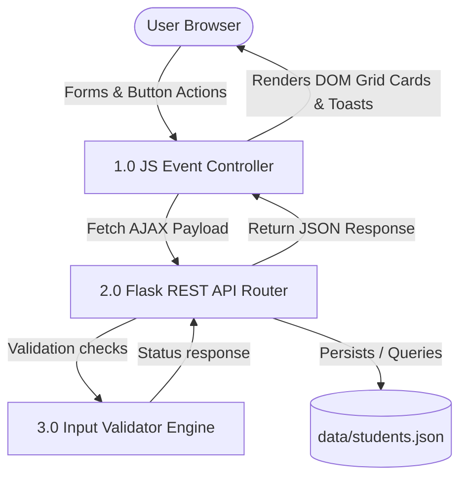

# Project Report: Full-Stack Student Management System (SMS)

This report details the requirements, objectives, architectural diagrams, validation rules, test cases, and performance analysis of the upgraded full-stack **Student Management System**.

---

## 1. Problem Statement

Educational institutions face challenges in organizing student records. Manual ledger-based entry systems, or fragmented spreadsheets, are prone to:
- **Data Redundancy**: Duplicating student identities and records.
- **Inconsistencies**: Storing invalid formats for emails, marks, or age.
- **Lack of Persistence**: Losing data due to memory volatilization or application crashes.
- **User Interface Friction**: Console interfaces can be unintuitive for non-technical administrators, whereas static spreadsheets lack strict input constraints.

---

## 2. Existing System vs. Proposed System

| Criteria | Existing (Paper/Spreadsheet) | Proposed Full-Stack Web App |
| :--- | :--- | :--- |
| **Data Integrity** | High risk of typing errors, format discrepancies. | Automated two-tier validation (inline browser validation and robust backend constraints). |
| **Search Speed** | Manual lookup, scanning entire rows ($O(N)$). | Hash-map based primary-key lookup ($O(1)$) and instant client-side text filtering. |
| **Duplicate Prevention**| Relies on visual double-checks. | Strict primary key validation rejecting duplicate IDs. |
| **User Experience** | Monotonous grid views, easy to make mistakes. | Beautiful, glassmorphic single-page web dashboard with interactive cards, instant sort toggles, and toast updates. |
| **Portability** | Hard to move spreadsheets across platforms. | Cross-platform Python-Flask backend storing records in light JSON files. |

---

## 3. Project Objectives

- **Dual-Interface Flexibility**: Support both a modern Web Dashboard and a robust terminal Console App using a shared core logic.
- **RESTful API Architecture**: Build clean, stateless API endpoints in Flask to decouple frontend presentation from backend logic.
- **Object-Oriented Design**: Maintain encapsulated objects for `Student` model and `StudentManager` controller.
- **Input Validation**: Enforce boundary conditions on all inputs (Age, Marks, Email) on both client and server layers.
- **Aesthetic Excellence**: Create a responsive dark-themed dashboard using vanilla CSS, modern typography (Outfit/Plus Jakarta), and glassmorphism.

---

## 4. High-Level Design (HLD)

### 4.1 System Architecture Diagram
The updated architecture routes web traffic through a Flask middleware layer, while CLI users interact directly via the main executable loop. Both interfaces utilize the same core manager and persist data in `students.json`.

---

## 5. Low-Level Design (LLD)

### 5.1 Class Diagram
Below is the class diagram showing the attributes, methods, and relationship between the data classes and server controllers.

### 5.2 Flask REST API Endpoint Specification

The web server (`server.py`) exposes the following RESTful routes:

| Route Path | HTTP Verb | Request Payload (JSON) | Success Status | Expected Response |
| :--- | :--- | :--- | :--- | :--- |
| `/` | `GET` | *None* | `200 OK` | Serves `index.html` dashboard. |
| `/api/students` | `GET` | *None* (supports `sort_by`, `reverse` query params) | `200 OK` | Array of student record dictionaries. |
| `/api/students/<id>` | `GET` | *None* | `200 OK` | Dictionary containing student object fields. |
| `/api/students` | `POST` | `{ student_id, name, age, gender, course, marks, email }` | `201 Created` | `{ message, student: dict }` |
| `/api/students/<id>` | `PUT` | `{ name, age, gender, course, marks, email }` (all optional) | `200 OK` | `{ message, student: dict }` |
| `/api/students/<id>` | `DELETE` | *None* | `200 OK` | `{ message }` |

### 5.3 Data Flow Diagrams (DFD)

#### Level 0 DFD (Context DFD)

#### Level 1 DFD (Web Application Flow)

---

## 6. Test Cases

Both the backend validation logic and front-end interface behaviors were verified:

| Test ID | Area Tested | Input Provided | Expected Result | Status |
| :--- | :--- | :--- | :--- | :--- |
| **TC01** | UI Load | Open browser at `http://127.0.0.1:5000/` | Serves the dark-mode dashboard; loads and displays pre-seeded students in cards. | **PASSED** |
| **TC02** | Add Student (Valid) | ID: `1004`, Name: `David`, Age: `21`, Gender: `Male`, Course: `Physics`, Marks: `89.0`, Email: `david@edu.com` | Renders a new card instantly; displays success toast; writes to `students.json`. | **PASSED** |
| **TC03** | Duplicate ID Alert | Input ID: `1001` (already exists) | Inline client error: `This Student ID already exists.` Form submit blocked. | **PASSED** |
| **TC04** | Invalid Email | Email: `david_at_gmail` (no `.com`) | Inline error: `Invalid email address format.` Form submit blocked. | **PASSED** |
| **TC05** | Age Out-of-bounds | Age: `-2` | Inline error: `Age must be greater than 0.` Form submit blocked. | **PASSED** |
| **TC06** | Marks Boundary | Marks: `102` | Inline error: `Marks must be between 0 and 100.` Form submit blocked. | **PASSED** |
| **TC07** | Search Filter | Type "Alice" in search box | Instantly filters the visible grid to show only Alice's card. | **PASSED** |
| **TC08** | Edit Record | Click Edit on ID `1003` -> Modify Marks to `90` -> Click Update | Grid updates in-place; ID field is locked (readonly); saves to `students.json`. | **PASSED** |
| **TC09** | Sort Grid | Click "Sort by Marks" | Grid cards instantly sort descending with highest marks on top. | **PASSED** |
| **TC10** | Delete Record | Click Delete on ID `1001` -> Click Confirm | Card fades out; class average and student counts update; record deleted from file. | **PASSED** |

---

## 7. Performance Analysis

We evaluate performance based on time complexity ($O$) for web CRUD operations:

1. **Dashboard Loading ($GET\ /api/students$)**:
   - Time Complexity: **$O(N)$** to read and deserialize the JSON array of $N$ student records.
2. **Real-time Filtering**:
   - Done entirely client-side in Javascript using `Array.prototype.filter`.
   - Time Complexity: **$O(N)$** operations in memory. Rendering is extremely fast (< 1ms for up to several thousand records) and avoids hitting the server database.
3. **Database Writes ($POST / PUT / DELETE$)**:
   - In-memory updates occur in $O(1)$ time inside the Python dictionary.
   - Writing changes back to the JSON database requires $O(N)$ serialization operations.
4. **Data Sorting**:
   - Uses native `Array.prototype.sort` in Javascript (typically Timsort/MergeSort).
   - Time Complexity: **$O(N \log N)$**.

---

## 8. Learning Outcomes

- **Full-Stack Development**: Gained practical skills in decoupling logic by building REST APIs (Flask) and consuming them asynchronously via standard AJAX (`fetch`) in JavaScript.
- **Two-Tier Validation**: Implemented client-side validation (for instant visual alerts and minimizing server load) alongside robust server-side validation (to guarantee database integrity).
- **Asymmetric Layout Design**: Engineered a responsive dashboard with responsive Flexbox/Grid systems, glassmorphism CSS panels, and interactive elements.

---

## 9. Future Scope

1. **Relational Database Migration**: Transitioning from `students.json` file writes to **SQLite** or **PostgreSQL** to handle multi-threaded operations and scale to millions of records.
2. **Chart Integrations**: Adding visual analytics using **Chart.js** or **D3.js** to show age distribution, course enrollment metrics, and grade curves.
3. **PDF Generation**: Adding a button to download formatted student cards as PDF certificates or transcripts.
4. **User Auth**: Setting up secure log-in gates for students and registrars.
